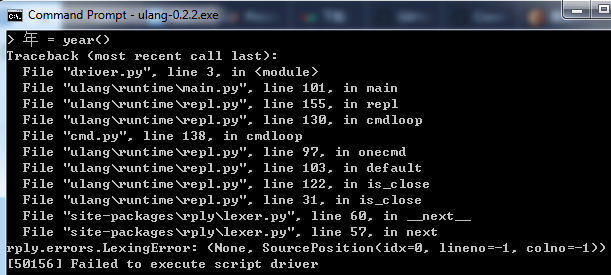
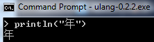
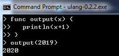
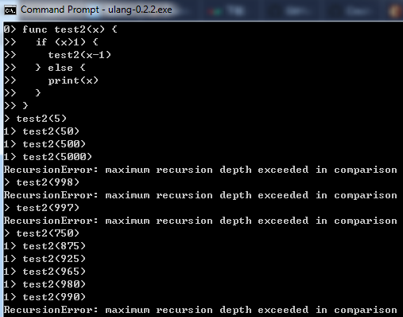

[原文链接](https://www.zhihu.com/question/366509495/answer/977696328)

可惜还没看到几个切题的回答。下面是基于 @yang leonier 的[回答](https://www.zhihu.com/question/366509495/answer/975810766)的最新进展作的个人摸索（强烈呼吁官方早日出文档，以避免无端猜度）。

因为个人比较关注中文的支持程度，首先尝试了中文命名标识符：

貌似不支持，残念。

报错信息中可见实现依赖了[rply库](https://pypi.org/project/rply/)，也侧面验证了它的一定原创性。最后的错误码貌似是源于[pyinstaller](https://stackoverflow.com/questions/40716346/windows-pyinstaller-error-failed-to-execute-script-when-app-clicked)，因此此exe很可能是它打的包。

还好支持中文字符串：

接着运气试出了函数定义，是func：

尝试了递归，发现有990层限制：

从这个错误信息看，它的运行时貌似是[基于Python3的](https://stackoverflow.com/questions/3323001/what-is-the-maximum-recursion-depth-in-python-and-how-to-increase-it)，在Python2.7.16下试了类似代码，发现错误信息不同`RuntimeError: maximum recursion depth exceeded`，而在Python3.8.1下试了是同样错误信息。但这里就好奇为何它还不支持中文命名标识符。。可能是实现的前端在词法分析这步就拦住了。如果是这样，应该可以早日改进。另外，Python3.8.1是在996层递归报的错，这六层的差距也许就是木兰转译为Python运行码的代价？

@minisys [验证了](https://www.zhihu.com/question/366509495/answer/977687177)支持__import__ 。如果能导入python的现有库，倒是个很不错的特性，这样可以利用python的现有生态。

也还没有看到相应的IDE（或插件）的效果，期待。