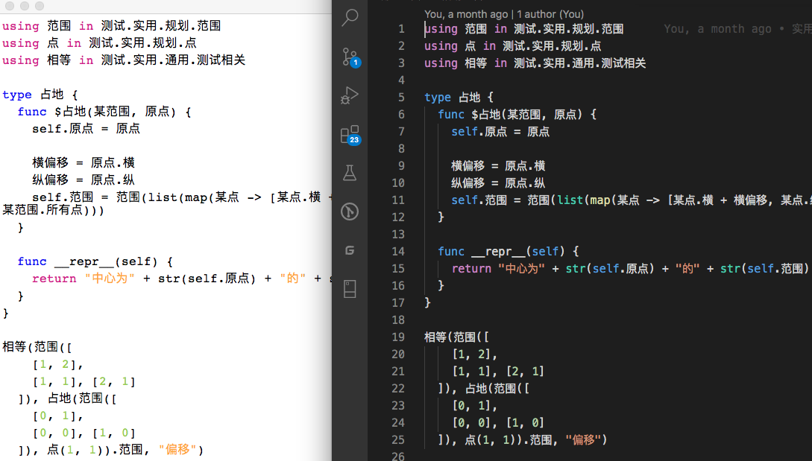

***所有相关源码在[码云](https://gitee.com/MulanRevive/mulan-rework)***

[早先](https://zhuanlan.zhihu.com/p/149635350)用 Python 实现了高亮编辑器的演示，上周将其改写为木兰代码，并作了重构和修正、添加测试用例，现在应该算脱离了“演示期”。

## 功能

实现了与[VS Code 木兰编程语言插件](https://marketplace.visualstudio.com/items?itemName=CodeInChinese.ulang)（右侧）类似的高亮效果：



## Python 实现改为木兰

改写过程总体算顺利，但注意到两点。一是 Python 的字符串插值在木兰中的对应功能，现在还尚未在本项目重现。经尝试，木兰字符串插值的两种格式（为啥要支持两种呢？）如下，待之后实现：
```
a = 3
print("a`a`a") // 输出 a3a
bb = 44
print("o\(bb\)t") // 输出 o44t
```

二是判断字典是否包含某个键值，Python 里很简单用`键值 in 字典`就可以，但至今没发现木兰针对此操作的类似语法。于是只能暂用`字典.get(键值) != nil`判断。期间还犯个低级错误，用了`!字典.get(键值)`，不巧对应值恰好为 0，结果查了好一会错。

## 高亮原理

虽然对 VSC 的代码高亮原理不甚了解，但在编写木兰语言插件过程中，感觉就是规定了一系列对应词法规则的正则表达。而木兰使用的 rply 库实现的词法分析器中也是类似一系列正则表达。

这个简易高亮编辑器就是直接调用了木兰的词法分析器，对源码进行分析，获得所有除了注释之外的词的属性和位置信息：

```javascript
  各词 = 词法分析器.分词器.lex(源码)

  各代码段 = list(map(词 -> {
    行号 = 词.getsourcepos().lineno
    列号 = 词.getsourcepos().colno - 1
    词长 = len(词.getstr())
    return 代码段(词.name, 行号, 列号, 列号 + 词长)
  }, 各词))
  各行代码段 = 按某项生成映射(各代码段, 段 -> 段.行, 段 -> 段)
```

接下来暂时把所有跳过的部分识别为注释：

```javascript
  所有行 = 源码.splitlines()
  for 索引 in range(len(所有行)) {
    行号 = 索引 + 1
    列号 = 0
    // 取本行所有代码段, 将跳过部分全部置为注释 TODO: 保险起见最好再次检查是否为注释
    if 各行代码段.get(行号) {
      本行代码段 = 各行代码段.get(行号)
      for 段 in 本行代码段 {
        if 段.起 > 列号 + 1 {
          各代码段.append(代码段(注释, 行号, 列号, 段.起))
        }
        列号 = 段.止
      }
    }

    if 列号 < len(所有行[索引]) {
      各代码段.append(代码段(注释, 行号, 列号, len(所有行[索引])))
    }
  }
```
再基于每段代码的属性进行颜色设置即可。

## 代码统计

下面是几个主要部分的代码行数统计，格式为：上次->现在。

- 木兰代码量
  - `编辑器`，包括实现与测试都是木兰代码：163
  - 木兰测试用例：1919 -> 1966

- Python 总代码量（包括测试部分）：2418 -> 2321
  - `演示高亮.py`：100 -> 0 改为用木兰实现
  - `环境.py`，加载木兰模块：149 -> 150
  - `测试/运行所有.py`，检验所有木兰测试代码片段：180 -> 181
  - 未变
    - `分析器/语法分析器.py`：913
    - `分析器/词法分析器.py`：190
    - `分析器/语法树.py`：178
    - `交互.py`，交互环境（REPL）：138
    - `分析器/语法成分.py`，从语法分析器中提取出来的枚举常量：78
    - `功用/反馈信息.py`：49
    - `中.py`，主程序：40
    - `分析器/错误.py`：17
    - `测试/unittest/语法树.py`，确保生成的语法树与原始版本一致：67
    - `测试/unittest/交互.py`，交互环境相关测试：28
