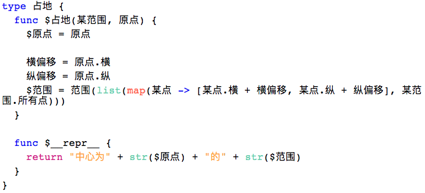

***所有相关源码在[码云](https://gitee.com/MulanRevive/mulan-rework)***

这几天复现了木兰编程语言中 $ 的功能（细节见第二部分）。编辑器的“代码段”类原本（左侧）有 12 处 self，改写后（右侧）看起来就简洁了一些：


后三个函数原本形参只有一个 self，现在变为没有形参，[括号也可以省了](https://zhuanlan.zhihu.com/p/158432288)。话说这种 $ 的用法也许 PHP 开发者会有特别的感觉？另外，是否要对 $ 打头的标识符进行高亮处理呢？

之前 @水木易安 （开源中国）指出了编辑器尚未对内置函数（如 map、print）、类型（如 str、list）进行高亮，于是作了些改进。配色比较随意，望 UX 大佬指点：



匿名函数中的“->”，感觉语义和函数定义的“func”相近，于是用了同样高亮风格。

## $ 的两种语义

### 1. $ 打头的标识符

意为属于当前个体。如开头例程中的“$词性”等价于“self.词性”。

如果是函数，第一个形参自动设为 self。如例程中的
```
func $开始() {...}
```
等价于
```
func 开始(self) {...}
```

### 2. 单指 self

与“true/false/nil“类似，可如下使用：
```java
type 人 {
  func $起名(名字) {
    $名字 = 名字; return $
  }
}
println(人().起名("木兰").名字)
```

## 代码统计

下面是几个主要部分的代码行数统计，格式为：上次->现在。

- 木兰代码量
  - `编辑器`，包括实现与测试都是木兰代码：163 -> 184
  - 木兰测试用例：1966 -> 2001
- Python 代码量（包括测试部分）：2321 -> 2338
  - `分析器/语法分析器.py`：913 -> 925
  - `分析器/词法分析器.py`：190 -> 195
  - 未变
    - `分析器/语法树.py`：178
    - `测试/运行所有.py`，检验所有木兰测试代码片段：181
    - `环境.py`，加载木兰模块：150
    - `交互.py`，交互环境（REPL）：138
    - `分析器/语法成分.py`，从语法分析器中提取出来的枚举常量：78
    - `功用/反馈信息.py`：49
    - `中.py`，主程序：40
    - `分析器/错误.py`：17
    - `测试/unittest/语法树.py`，确保生成的语法树与原始版本一致：67
    - `测试/unittest/交互.py`，交互环境相关测试：28
