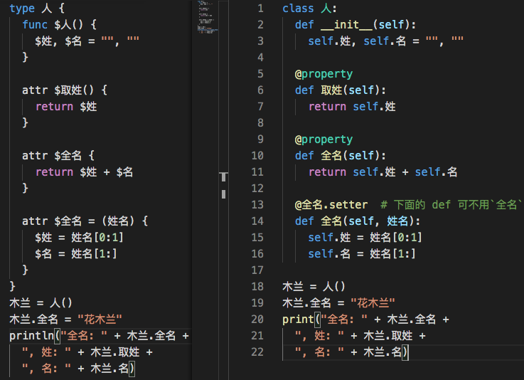

***本项目旨在重现「木兰」编程语言的语法和功能，已开源在[码云](https://gitee.com/MulanRevive/mulan-rework)。所有例程演示的语法可以用原始的木兰可执行文件  [ulang-0.2.2.exe](https://gitee.com/MulanRevive/bounty/tree/master/%E5%8E%9F%E5%A7%8B%E8%B5%84%E6%96%99/%E5%8F%AF%E6%89%A7%E8%A1%8C%E6%96%87%E4%BB%B6) 检验。如发现有异烦请告知，定将礼谢。***

[上篇](https://zhuanlan.zhihu.com/p/259467288)演示了 $ 在木兰中的部分用途。在开源中国的[木兰更新资讯](https://www.oschina.net/news/118866/mulan-about-highlight)评论区，有几位提出木兰和 PHP 中的 $ 用法有很大不同。

这几天基本重现了至今发现的 $ 在木兰中的语法功能，本文逐一介绍。以后有机会再尝试与 PHP 作对比。

# 木兰的 $ 与 self

木兰编程语言中, $ 的语义是 self。但木兰的 self 与 Python 相比有拓展含义。

多数情况下，$ 都可用对应的 self 语法代替。下面先介绍这部分语法。

## 1 self 可代替

### 1.1 类型之外

Python 中的 self 仅在类型中使用，木兰可在类型外使用。self() 返回当前线程（***下面带 > 的是在[木兰交互环境](https://zhuanlan.zhihu.com/p/245390062)下运行的结果***）。
```
> println(self())
<_MainThread(MainThread, started 140735684096896)>
> println(self().ident)
140735684096896
```
$() 并不允许，因为单独的 $ 不是可识别的标识符。 

可以如下定义与引用属于当前线程的变量，与全局变量不同：
```
> self.x = 1
> self.x
1
> x
(..•˘_˘•..) 请先定义'x'再使用位于第1行
```
对应到 $ 的用法就是：
```
> $x = 1
1
> $x
1
```

### 1.2 类型之内

[上篇](https://zhuanlan.zhihu.com/p/259467288)演示的用途，包括类型内变量与方法、单独使用，都可用 self 语法代替，而且 self 的语义与 Python 相同。本周复现了一个不能用 self 代替的语法，见下一部分。

## 2 self 不可代替

### 2.1 可用关键词命名变量

与 PHP 类似，带 $ 可以用关键词命名变量：
```
> $while = 4
> $while
4
```
而用 self 则不允许：
```
> self.while = 3
(..•˘_˘•..) File "<STDIN>", line 1:6, unexpected token "WHILE"
self.while = 3
     ^
> self.while
(..•˘_˘•..) File "<STDIN>", line 1:6, unexpected token "WHILE"
self.while
```

### 2.2 应变属性

应变属性（attr）相关语法对应 Python 中的 @property 和 setter。这里起名“应变属性”是因为 attribute 和 property 的含义区别很微妙，暂时未找到合适中文与类型内一般属性变量作区分，于是用功能特点命名。下图左边为木兰，右边为 Python 同功能代码，重点在三个 attr。这部分功能未发现可代替的 self 语法。




## 后感

作为未参与木兰原始设计的第三方，仅从复现出的功能很难完全领会设计意图。就个人感觉，木兰的 $ 相关语法设计简化了 Python 的 self 相关语法。对 self 的语义拓展虽然看似信手拈来但也有合理之处。是否对多线程有特别好处待研究。

请赐教。

-----------

### ***附录：代码量统计***

主要部分的代码行数统计，格式为：上次->现在。

- 木兰代码量
  - `编辑器`，包括实现与测试都是木兰代码：184
  - 木兰测试用例：2001 -> 2074
- Python 代码量（包括测试部分）：2338 -> 2379
  - `分析器/语法分析器.py`：925 -> 953
  - `分析器/词法分析器.py`：195 -> 198
  - `测试/运行所有.py`，检验所有木兰测试代码片段：185
  - `环境.py`，定义全局方法：150 -> 156
  - `分析器/语法成分.py`，从语法分析器中提取出来的枚举常量：78 -> 79
  - 未变
    - `分析器/语法树.py`：178
    - `交互.py`，交互环境（REPL）：138
    - `功用/反馈信息.py`：49
    - `中.py`，主程序：41
    - `分析器/错误.py`：17
    - `测试/unittest/语法树.py`，确保生成的语法树与原始版本一致：67
    - `测试/unittest/交互.py`，交互环境相关测试：28
