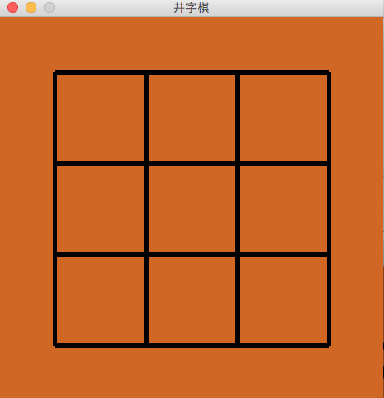
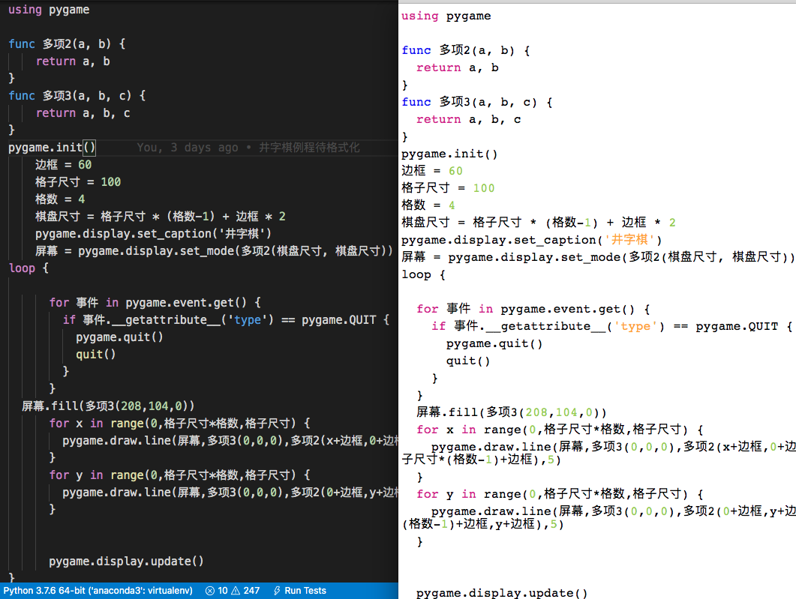
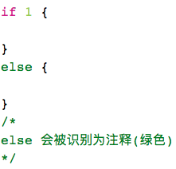

***本项目旨在重现「木兰」编程语言的语法和功能，已开源在[码云](https://gitee.com/MulanRevive/mulan-rework)。所有例程演示的语法可以用原始的木兰可执行文件  [ulang-0.2.2.exe](https://gitee.com/MulanRevive/bounty/tree/master/%E5%8E%9F%E5%A7%8B%E8%B5%84%E6%96%99/%E5%8F%AF%E6%89%A7%E8%A1%8C%E6%96%87%E4%BB%B6) 检验。如发现有异烦请告知，定将礼谢。***

本文介绍的是个临时起意的副线任务，但也是木兰编程语言生态建设的一步。

## 缘由

前两天为了做井字棋游戏，[中文化](https://www.zhihu.com/pin/1295639029003264000)了一个[例程](https://github.com/ysdshuaishuai/magician/blob/master/%E4%BA%95%E5%AD%97%E6%A3%8Bgui.py)，并从中截取了绘制棋盘的部分代码，改写成了木兰代码，打算在此基础上进一步开发。

代码很短，三十多行，也抛出了预期效果如下：



问题是，由于是随手拷贝自 Python 源码，也没有特别注意保留行头空格（当然也仗着木兰对缩进量不敏感），导致代码缩进非常参差不齐，见下图左侧：



虽然手工调整缩进不用几分钟，但因为马上就想到可以用木兰[交互环境](https://zhuanlan.zhihu.com/p/245390062)获取未配对的括号数的机制来实现自动缩进，忍不住在自制编辑器中集成了这个功能，实现挺方便（因为有之前的高亮部分打底），格式化效果也如预期见上图右侧。

## 原始方案
基本思路请看十五行木兰源码：
```java
func 格式化(源码) {
  缩进单位 = "  "
  所有行 = 源码.splitlines()
  部分源码 = ""
  格式源码 = ""
  // TODO: 每行的缩进量由当前行之前的代码决定, 复杂度为 N^2 (N 为代码行数)
  for 行号 in 1..len(所有行) {
    当前行 = 所有行[行号 - 1]
    部分源码 += 当前行
    各代码段 = 解析(部分源码)
    缩进数 = 未配对括号数(各代码段)
    格式源码 += 缩进数 * 缩进单位 + 当前行.strip() + "\n"
    部分源码 += "\n"
  }
  return 格式源码
}
```
但这个 N^2 的复杂度如鲠在喉。起初由于那个棋盘代码只有 34 行，运行格式化还能接受（后测大约 240 毫秒），就有先放着不管的打算，但手贱跑了一下至今项目内最长的木兰源码文件——318 行的“儿歌.ul”，结果跑了 12 秒多才完成不说还报个神奇的警告：
```
2020-10-04 11:48:03.095 Python[40873:15785576] IMKClient Stall detected, *please Report* your user scenario attaching a spindump (or sysdiagnose) that captures the problem - (imkxpc_bundleIdentifierWithReply:) block performed very slowly (8.90 secs).
```

是可忍孰不可忍。于是着手改为 N 复杂度。结果，之前留的一个雷还是踩上了。

## 雷在词法分析

一个简单木兰例程：
```java
func a {
  //前面有空格
}
```
原始木兰可执行文件的 `--dump-tokens` 选项只能看到词名，不能看到行列号，但在逆向工程添加行列号输出后可以看到如下分词信息：
```
Token('FUNC', 'func')=1:0
Token('IDENTIFIER', 'a')=1:5
Token('LBRACE', '{\n')=1:7
Token('RBRACE', '\n}')=2:9 <------
```
后大括号（RBRACE）的行号是 2，列号是 9。为啥不是行号 3，列号 0 呢？

原因在分词规则的正则表达式包含了前置的所有换行：
```python
lg.add('LBRACE', '{\\r*\\n*', flags=(re.DOTALL))
lg.add('RBRACE', '\\r*\\n*}', flags=(re.DOTALL))
```
不仅是后大括号，像 elif、else 也是如此：
```python
lg.add('ELIF', '\\r*\\n*\\s*elif\\s*\\r*\\n*', flags=(re.DOTALL))
lg.add('ELSE', '\\r*\\n*\\s*else\\s*\\r*\\n*', flags=(re.DOTALL))
```

在实现[高亮](https://zhuanlan.zhihu.com/p/257726779)不久后，就发现了这个雷。由于这个分词规则，之前采用的简陋的判断注释算法会导致假注释段，比如这样的 else 就被误认为注释：


为了尽快搞定复杂度 N，暂时采取了对分词结果中的后大括号作处理、根据换行数量调整行号的方法，这样就可以准确地计算每行未匹配的大括号数量（原始方案不存在这个问题是因为每次新加的“当前行”都不包含行末换行符），并对部分假注释段作了清理，但其他类似雷还未清。

## 小结

现在测试格式化（仅基于大括号位置自动调整缩进）性能，34 行的井字棋界面在 20 毫秒内，318 行的“儿歌.ul”在 80 毫秒以内（150 倍，不算标题党吧），效果如预期。

虽然仍在雏形阶段，但似乎离用木兰实现的编辑器编写木兰代码又近了一步。下面打算先搁置之前的“井字棋”，先将完成一个最简易的木兰代码编辑器作为短期目标，并为此复现需要的木兰编程语言功能。暂时想到的功能有：

- 保存当前文件
- 根据输入内容更新高亮

这样就可以在建设木兰生态的同时检验木兰编程语言的功能和实用性。

-----------

### ***附录：代码量统计***

主要部分的代码行数统计，格式为：上次->现在。

- 木兰代码量（总木兰代码量超越 Python 代码量 lol）
  - `编辑器`，实现与测试都是木兰代码：184 -> 333
  - 木兰测试用例，包括部分使用小程序：2074 -> 2160
- Python 代码量（包括测试部分）：2379 -> 2396
  - `分析器/语法分析器.py`：953 -> 958
  - `分析器/词法分析器.py`：198
  - `测试/运行所有.py`，检验所有木兰测试代码片段：185
  - `环境.py`，定义全局方法：156 -> 157
  - `分析器/语法成分.py`，从语法分析器中提取出来的枚举常量：79
  - 未变
    - `分析器/语法树.py`：178
    - `交互.py`，交互环境（REPL）：138
    - `功用/反馈信息.py`：49
    - `中.py`，主程序：41
    - `分析器/错误.py`：17
    - `测试/unittest/语法树.py`，确保生成的语法树与原始版本一致：67
    - `测试/unittest/交互.py`，交互环境相关测试：28
