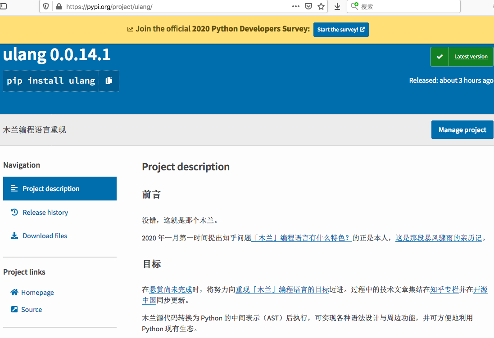

号外！木兰重现项目首次在 pypi 发布：[ulang 0.0.14.1](https://pypi.org/project/ulang/)

安装方法：`pip install ulang`，使用方法与例程请见 pypi 项目首页（源于[码云首页](https://gitee.com/MulanRevive/mulan-rework)）。已在 Mac 和 Win7 安装运行成功。

***注意！必须先安装 python 3.7***

## 版本号的来由

之前基于逆向工程的体验版打包在 [mulang](https://pypi.org/project/mulang/)，而现在这个版本是[木兰重现项目](https://gitee.com/MulanRevive/mulan-rework)生成的。mulang 的版本号到了 0.0.13，为避免版本降低导致的困惑，选择了继续增加版本号到 0.0.14。至于末尾加更小版本，主要考虑[原始可执行文件](https://gitee.com/MulanRevive/bounty/tree/master/%E5%8E%9F%E5%A7%8B%E8%B5%84%E6%96%99/%E5%8F%AF%E6%89%A7%E8%A1%8C%E6%96%87%E4%BB%B6)版本为 0.2.2，在确认完成所有功能重现之前，版本号都应低于它。因此加更小一位以达到三位版本号的效果。

## 与逆向工程的区别 

- 逆向工程未经过较系统测试。重现项目针对每条语法规则进行了测试，包括[一百个左右测试用例](https://gitee.com/MulanRevive/mulan-rework/blob/master/%E6%B5%8B%E8%AF%95/%E8%BF%90%E8%A1%8C%E6%89%80%E6%9C%89.py)，并且在原始木兰可执行文件 ulang-0.2.2.exe 运行通过（测试例程中的中文标识符需改为英文，因为原始木兰不支持中文标识符）。
- 逆向工程并未经过实际应用检验。重现项目[实用](https://gitee.com/MulanRevive/mulan-rework/tree/master/测试/实用)部分与[木兰代码编辑器](https://gitee.com/MulanRevive/mulan-rework/tree/master/编辑器)本身，累计一千多行木兰源码，涵盖了语言功能的各个方面，包括调用 Python 生态等。
- 估计逆向工程相比重现项目有更多语法支持，重现项目仍有[相当部分木兰功能](https://gitee.com/MulanRevive/mulan-rework/issues/I1SEU5)未完成。
- 逆向工程不再打算改动，而仅作为实现参考。今后将只维护重现项目。

## 不选择 exe 格式发布的缘由

- 不支持 Mac/Linux 运行
- 更多工作量
- 当前仍处于开发期，使用便捷性的优先级尚不高

## 欢迎尝鲜

如果发现[未完成功能](https://gitee.com/MulanRevive/mulan-rework/issues/I1SEU5)之外的木兰功能、或者重现项目的功能与[木兰原始可执行文件](https://gitee.com/MulanRevive/bounty/tree/master/%E5%8E%9F%E5%A7%8B%E8%B5%84%E6%96%99/%E5%8F%AF%E6%89%A7%E8%A1%8C%E6%96%87%E4%BB%B6)有差异之处、或者使用问题，欢迎报告，[将酌情礼谢](https://gitee.com/MulanRevive/bounty/issues/I1YA1H)！
