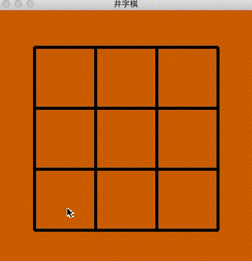

安装方法：`pip install ulang`，使用方法与例程请见 pypi 项目首页（源于[码云首页](https://gitee.com/MulanRevive/mulan-rework)）。 ***注意：必需 python 3.7***

[前文](https://zhuanlan.zhihu.com/p/262210417)只画了个井字棋棋盘，本版本完成与自己对弈的功能（与原 Python 代码功能相同）。在此期间检验已重现的部分木兰的实用程度，并在使用中发现需要重现的语法进而加以实现。

##  1 实例演示


主要木兰代码如下（完整代码[在此](https://gitee.com/MulanRevive/mulan-rework/blob/master/%E6%B5%8B%E8%AF%95/%E5%AE%9E%E7%94%A8/%E6%A3%8B/%E4%BA%95%E5%AD%97/%E4%B8%AD.ul)，基本沿用原 Python 代码结构，仅作了些微重构）：
```java
pygame.init()
pygame.display.set_caption('井字棋')
屏幕 = pygame.display.set_mode(tuple(棋盘尺寸, 棋盘尺寸))
loop {
  for 事件 in pygame.event.get() {
    事件类型 = 事件.__getattribute__('type')
    if 事件类型 == pygame.QUIT {
      pygame.quit()
      quit()
    } elif 进行状态 == 状态.对弈 and 事件类型 == pygame.MOUSEBUTTONUP {
      x, y = pygame.mouse.get_pos()
      横格 = int((x - 边框) * 1.0 / 格子尺寸)
      纵格 = int((y - 边框) * 1.0 / 格子尺寸)
      if 在棋盘内(横格, 纵格) and !该位置已占(横格, 纵格) {
        所有落子.append(tuple(横格, 纵格, 哪方))
        if 胜负已分() {
          进行状态 = 哪方 == 棋手.X ? 状态.X胜 : 状态.O胜
        } else {
          哪方 = 哪方 == 棋手.X ? 棋手.O : 棋手.X
        }
      }
    }
  }
  屏幕.fill(背景色)
  画格子()

  for 落子 in 所有落子 {
    画棋子(落子)
  }

  宣布 = 进行状态 != 状态.对弈 ?
    ((进行状态 == 状态.X胜 ? 'X' : 'O') + " 赢了!!")
    : (len(所有落子) == 9 ? "平局" : "")
  // 比赛结束
  if 宣布 != "" {
    字体 = pygame.font.SysFont("pmingliu", 50)
    文字 = 字体.render(宣布, true, 红色)
    屏幕.blit(文字, tuple(20,190))
  }

  pygame.display.update()
}
```

## 2 语言功能

### 2.1 元组（tuple）
[之前](https://zhuanlan.zhihu.com/p/262835743)未发现元组初始化的简便方法。本周发现可用内置函数“tuple(1, 2, 3)”进行初始化

### 2.2 枚举
与 Python 定义枚举类似，但之前一直没用过，井字棋示例中第一次用：
```java
using Enum in enum
type 棋手 : Enum {
  {
    X = 1
    O = 2
  }
}
```

### 2.3 超过两项变量赋值

早先只允许两项，如：`a, b = 1, 2`。现在支持更多项如：`a, b, c = 1, 2, 3`。也同时支持了 `for a, b, c in t { ... }`  

### 2.4 其他

恢复了自带木兰代码编辑器功能，并继续修正的格式化功能

-----------

### ***附录：代码量统计***

主要部分的代码行数统计，格式为：上次->现在。

- 木兰代码量
  - 编辑器，实现与测试都是木兰代码：333 -> 381
  - 木兰测试用例，包括部分实用小程序（如井字棋）：2160 -> 2304
- Python 代码量（包括测试部分）：2425 -> 2473
  - `分析器/语法分析器.py`：986 -> 989
  - `测试/运行所有.py`，检验所有木兰测试代码片段：185 -> 187
  - `环境.py`，定义全局方法：157 -> 160
  - `中.py`，主程序：41 -> 45
  - `setup.py`, 33
  - 未变
    - `分析器/词法分析器.py`：198
    - `分析器/语法树.py`：178
    - `交互.py`，交互环境（REPL）：138
    - `分析器/语法成分.py`，从语法分析器中提取出来的枚举常量：79
    - `功用/反馈信息.py`：49
    - `分析器/错误.py`：17
    - `测试/unittest/语法树.py`，确保生成的语法树与原始版本一致：67
    - `测试/unittest/交互.py`，交互环境相关测试：28
