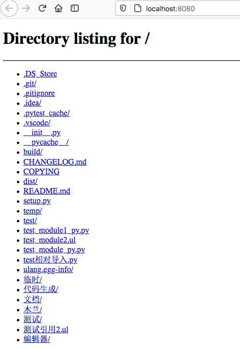
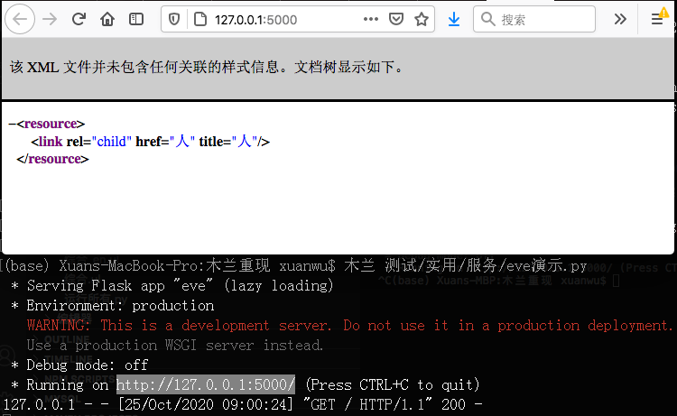

安装：`pip install ulang`，用法与例程请见 [PyPI](https://pypi.org/project/ulang/)。源码位于[开源中国](https://gitee.com/MulanRevive/mulan-rework)）。 ***注意：必需 python 3.7，源码文件需 UTF-8 编码***

本周用木兰实现了 http.server 网络服务演示如下：
```java
using SimpleHTTPRequestHandler in http.server
using socketserver

端口 = 8080

try 服务=socketserver.TCPServer(tuple("", 端口), SimpleHTTPRequestHandler) {
    println("请访问：http://localhost:8080/")
    服务.serve_forever()
}
```
本地访问效果：


作为对比，下面是 Python 的同功能源码（部分省略）：
```python
with socketserver.TCPServer(("", 端口), SimpleHTTPRequestHandler) as 服务:
    服务.serve_forever()
```

***可见木兰去掉了 with 和 as 两个关键词，将其合并到了 try 语法中。***

另外也尝试了使用网络服务框架。暂时未发现木兰如何支持修饰器 @route，于是不使用 bottle 或者 flask。

下面是木兰使用 [eve 框架](https://github.com/pyeve/eve)的演示：
```java
using Eve in eve

设置 = {'DOMAIN': {'人': {:}}}

服务 = Eve(settings=设置)
服务.run()
```
本地访问效果：


## 其他

### 0.0.14.5 修复 windows 下引用模块问题

早发现的 windows 下[测试问题](https://gitee.com/MulanRevive/mulan-rework/issues/I1U2HP)，是由于 windows 下默认编码 gbk，而打开引用模块源码文件时未指定 UTF-8 编码。

### 引用模块出错位置信息

之前，如果引用的模块加载时出错，报错信息中不包含具体出错信息。现在已修正：

```
$  木兰 测试/错误处理/引用问题模块.ul
 😰 请先定义‘a’再使用
“测试/错误处理/无此变量.ul”第1行：a
见第1行：using * in 测试.错误处理.无此变量
```

### 更多中文报错信息

像这样的木兰代码：
```java
try a=3 {
  print(a)
}
```

原本报错：`AttributeError: __enter__`，信息量很有限。

现在改为如下中文信息，并加上了参考链接：
```
 😰 需要添加此属性：__enter__
参考：https://stackoverflow.com/questions/1984325/explaining-pythons-enter-and-exit
见第1行：try a=3 {
```

-----------

### ***附：代码量统计***

主要部分的代码行数统计，格式为：上次->现在。

- 木兰代码量 2873 -> 2920
  - 编辑器，实现与测试都是木兰代码：402 -> 432 （初步重构，打算尽量减少对 Python tk 库的依赖，也许分为前后端实现）
  - 木兰测试用例，包括部分实用小程序（如井字棋）：2471 -> 2488
- Python 代码量（木兰实现与测试框架）：2523 -> 2574
  - `分析器/语法分析器.py`：990 -> 1002
  - `分析器/语法树.py`：188 -> 202
  - `分析器/词法分析器.py`：198 -> 201
  - `测试/运行所有.py`，检验所有木兰测试代码片段：189 -> 191
  - `环境.py`，定义全局方法：160 -> 162
  - `分析器/语法成分.py`，从语法分析器中提取出来的枚举常量：79 -> 81
  - `功用/反馈信息.py`：55 -> 65
  - 未变
    - `交互.py`，交互环境（REPL）：138
    - `功用/调试辅助.py`，：57
    - `中.py`，主程序：74
    - `setup.py`, 34
    - `分析器/错误.py`：17
    - `测试/unittest/语法树.py`，确保生成的语法树与原始版本一致：67
    - `测试/unittest/交互.py`，交互环境相关测试：28
