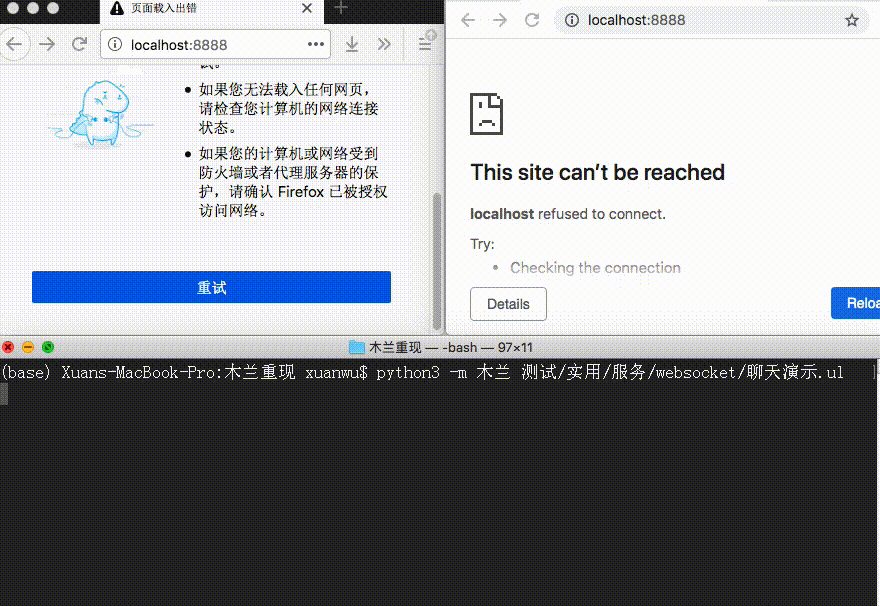

【安装：`pip install ulang`，用法与例程请见 [PyPI](https://pypi.org/project/ulang/)。源码位于[开源中国](https://gitee.com/MulanRevive/mulan-rework)。 ***注意：必需 python 3.7，源码文件需 UTF-8 编码***】

本周将 Python 框架 [tornado](https://github.com/tornadoweb/tornado)自带的用 websocket 实现聊天的例程改为木兰实现。顺便将该例程涉及的木兰与 Python 语法对比小结，包括本周重现的 super 语法等。

## 1 实例演示


主要木兰代码如下（完整代码[在此](https://gitee.com/MulanRevive/mulan-rework/blob/master/%E6%B5%8B%E8%AF%95/%E5%AE%9E%E7%94%A8/%E6%9C%8D%E5%8A%A1/websocket/%E8%81%8A%E5%A4%A9%E6%BC%94%E7%A4%BA.ul)）
```java
type 聊天渠道 : tornado.websocket.WebSocketHandler {
  {
    接收端 = set()
    历史 = []
    历史长度 = 200
  }

  func $get_compression_options {
    // Non-None enables compression with default options.
    return {:}
  }

  func $open {
    聊天渠道.接收端.add($)
  }

  func $on_close {
    聊天渠道.接收端.remove($)
  }

  func 更新历史(消息) {
    // 必须指定类
    聊天渠道.历史.append(消息)
    if len(聊天渠道.历史) > 聊天渠道.历史长度 {
      聊天渠道.历史 = 聊天渠道.历史[-聊天渠道.历史长度 :]
    }
  }

  func 广播(消息) {
    logging.info("发到%d个接收端", len(聊天渠道.接收端))
    for 某接收端 in 聊天渠道.接收端 {
      // TODO: try catch 尚待重现
      //try:
      某接收端.write_message(消息)
      //except:
      //    logging.error("Error sending message", exc_info=True)
    }
  }

  func $on_message(内容) {
    logging.info("收到消息: %r", 内容)
    parsed = tornado.escape.json_decode(内容)
    消息 = {"id": str(uuid.uuid4()), "body": parsed["body"]}
    消息["html"] = tornado.escape.to_basestring(
      $render_string("message.html", message=消息)
    )

    聊天渠道.更新历史(消息)
    聊天渠道.广播(消息)
  }
}
```

## 2 与例程涉及的 Python 语法对比

***下面都基于当前对木兰的认识，今后随重现项目进展可能修改***

### 必须（否则报错）

- 如碰到形参的关键词为 type，需改为位置形参。如原始例程中的：
```python
define("port", default=8888, help="run on the given port", type=int)
```
最后一个形参的 keyword 为 type，正好是木兰的语法关键词。因此只能改为位置形参（顺便中文化封装）：
```
func 定义(名称 : str, 默认=nil, 类型=nil, 帮助=nil) {
  define(名称, 默认, 类型, 帮助)
}
定义("port", 默认=8888, 帮助="在此端口运行服务", 类型=int)
```

- 木兰只有静态方法（staticmethod）。碰到 Python 的 classmethod 时，引用类变量时用类名取代cls。见上面的 `更新历史` 方法。
- 需 tuple() 初始化元组，见[前文介绍](https://zhuanlan.zhihu.com/p/266428706)
- 所有块改为 {}，取代 Python 中的冒号
- class 变 type，用冒号指定类型，包括指定形参类型、超类等
- 注释段用 /* */，注释行用 //
- import 变 using
- None 变 nil
- def 变 func
- 【本周】super() 变 super
- 【本周】不支持 **，改用列举形参
- 类变量需用｛｝包围
- 字典初始化 {:}


### 可选

- self 变 $，见[前文介绍](https://zhuanlan.zhihu.com/p/261048633)
- 构造函数用类名而非__init__
- 无参数函数定义时可省略 ()

-----------

### ***附：代码量统计***

主要部分的代码行数统计，格式为：上次->现在。

- 木兰代码量 2965 -> 3114
  - 编辑器，实现与测试都是木兰代码：432 -> 431 （在为分为前后端实现调研网络服务框架）
  - 木兰测试用例，包括部分实用小程序（如井字棋）：2533 -> 2683
- Python 代码量（木兰实现与测试框架）：2594 -> 2612
  - `分析器/语法分析器.py`：1008 -> 1019
  - `分析器/词法分析器.py`：204 -> 207
  - `测试/运行所有.py`，检验所有木兰测试代码片段：192 -> 194
  - `环境.py`，定义全局方法：171 -> 172
  - `分析器/语法成分.py`，从语法分析器中提取出来的枚举常量：81 -> 82
  - `功用/反馈信息.py`：65 -> 67
  - `测试/unittest/语法树.py`，确保生成的语法树与原始版本一致：67 -> 66
  - 未变
    - `分析器/语法树.py`：202
    - `交互.py`，交互环境（REPL）：138
    - `中.py`，主程序：74
    - `功用/调试辅助.py`，：57
    - `setup.py`, 34
    - `分析器/错误.py`：17
    - `测试/unittest/交互.py`，交互环境相关测试：28
