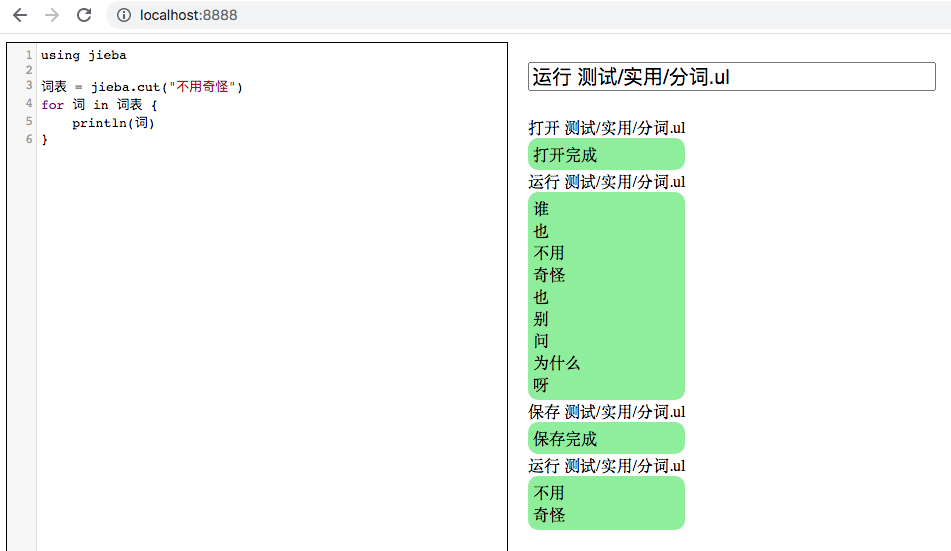

【安装：`pip install ulang`，用法与例程请见 [PyPI](https://pypi.org/project/ulang/)。源码位于[开源中国](https://gitee.com/MulanRevive/mulan-rework)。 ***注意：必需 python 3.7，源码文件需 UTF-8 编码***】

之前是用 tkinter 实现的木兰源码编辑器，但一直想将前端部分摆脱对 Python UI 库的依赖（[比如这种问题](https://bugs.python.org/issue42121)）。现在用一个 WebSocket 客户端做了个运行环境原型（与前文类似，用木兰源码编写了服务端）。在开发中，为避免将 tk 应用置于[其他线程运行](https://stackoverflow.com/questions/3567238/threaded-tkinter-script-crashes-when-creating-the-second-toplevel-widget)，转用基于 HTML 的代码编辑器。效果如下：



左侧为代码编辑器（[参考了前文实现](https://zhuanlan.zhihu.com/p/45236358)）；右侧上部输入各命令，下部显示输出。

在服务端，从木兰主程序截取了解析和运行木兰代码的 Python 代码段，将其改写为可以[读取 exec 输出](https://stackoverflow.com/questions/3906232/python-get-the-print-output-in-an-exec-statement)（为显示输出在客户端）后，再在木兰服务端调用。由于木兰语言并未内置 compile 和 exec 函数，因此这段 Python 代码并未改写为木兰代码。

在基于网络的运行环境外，原本的交互环境中，遇到词法错误会[直接退出](https://gitee.com/MulanRevive/mulan-rework/issues/I22MK6?from=project-issue)，体验不佳，在此版本修正。同时发现木兰使用的 rply 框架发布版 0.7.7 有个 bug，导致词法错误的行列号信息缺失，幸运的是发现此 bug 已在 rply 中[被修复了](
https://github.com/alex/rply/commit/6e16262dc6d434fc467eed83ed31ca764ba01a34)，但似乎[有些情况](https://github.com/alex/rply/pull/95#issuecomment-729513800)没被覆盖，仍需跟进。

由于 rply 发布版已许久未更新，也不知何时会更新包含上面补丁的发布版，一时没想到好办法绕过 rply 当前发布版使用补丁。在本地开发时，可以下载 rply 最新源码，用 `python setup.py install` 安装，使补丁在本地可用。效果如下：

```
> func a{
>> 1#2
 😰 词法错误：文件 "【标准输入】", 第2行, 第1列, 分词时没认出这个词 "#"
1✋#2
【下面暂时还有 rply 相关层信息，之后将除去】
```

-----------

### ***附：代码量统计***

主要部分的代码行数统计，格式为：上次->现在。

- 木兰代码量 3114 -> 3204
  - 运行环境，实现与测试大部为木兰代码：431 -> 524（添加了 WebSocket 服务端）
  - 木兰测试用例，包括部分实用小程序（如井字棋）：2683 -> 2680
- Python 代码量（木兰实现与测试框架）：2612 -> 2675
  - `分析器/语法分析器.py`：1019 -> 1013
  - `分析器/词法分析器.py`：207
  - `测试/运行所有.py`，检验所有木兰测试代码片段：194 -> 195
  - `环境.py`，定义全局方法：172
  - `交互.py`，交互环境（REPL）：138 -> 148
  - `分析器/语法成分.py`，从语法分析器中提取出来的枚举常量：81 -> 82
  - `功用/反馈信息.py`：71
  - `测试/unittest/语法树.py`，确保生成的语法树与原始版本一致：66
  - `编辑器/运行木兰.py`： 45
  - `分析器/错误.py`：17 -> 26
  - 未变
    - `分析器/语法树.py`：202
    - `中.py`，主程序：74
    - `功用/调试辅助.py`，：57
    - `setup.py`, 34
    - `测试/unittest/交互.py`，交互环境相关测试：28
