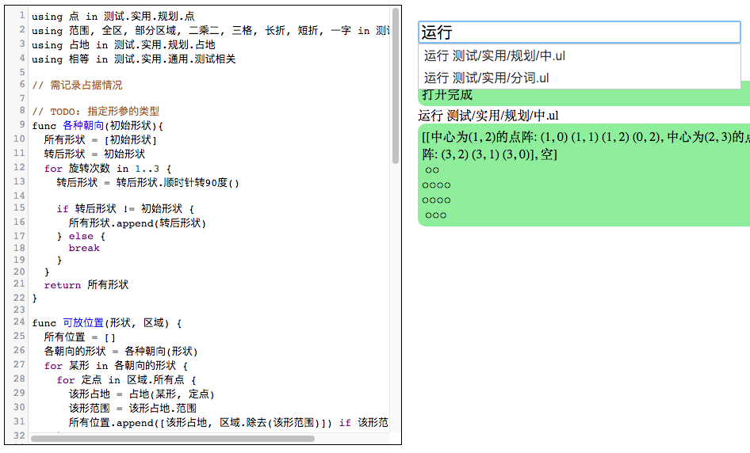

之前用木兰代码基于 tornado 框架编写服务后端，完成了代码编辑、运行的最基本操作。本周为其添加了 sqlite 数据库，用于保存输入历史并提供简单的补全功能，效果如下（输入“运行”后下拉框提示以往包含“运行”的输入）：



【安装：`pip install ulang`，用法与例程请见 [PyPI](https://pypi.org/project/ulang/)。源码位于[开源中国](https://gitee.com/MulanRevive/mulan-rework)。 ***注意：必需 python 3.7，源码文件需 UTF-8 编码***】

下面是访问数据库以提供补全项的木兰代码：
```java
type 预估请求: SessionMixin, tornado.web.RequestHandler {
  func $get {
    提示 = self.get_argument('term', nil)
    所有请求 = []

    // TODO: 优化?
    历史请求 = self.session.query(过往请求)
    if 提示 != nil {
      历史请求 = 历史请求.filter(过往请求.请求.like("%" + 提示 + "%"))
    }
    历史请求 = 历史请求.order_by(desc(过往请求.时间)).group_by(过往请求.请求).distinct()

    // logging.info(str(历史请求))  // 可查看 sql 语句
    // TODO: 通过拼音补全
    for 记录 in 历史请求 {
      所有请求.append(记录.请求)
    }
    $write({"历史" : 所有请求})
  }
}
```

期间发现，sqlalchemy 库中有个 func 方法，与木兰关键词重名。尚未想到如何在木兰中如何调用，暂不深究，今后需要此方法时再说。

### 改进测试

之前一直用运行木兰进程获取输出的方式进行功能测试，好处是 1）与用户使用方式很接近，能确保测试有效 2）可用同样方式测试原始木兰可执行文件 ulang-0.2.2.exe。但运行很慢，100 多个用例，每个都起一个进程，本机大约 30 秒。正好上周为开发环境获取输出内容，通过重定向标准输出的方式可以获得 exec 的输出，于是重用在测试中，并改写为 unittest 测试，现在测试所有用例耗时半秒左右。但发现 windows 下[字符串相关测试未过](https://gitee.com/MulanRevive/mulan-rework/issues/I1U2HP?from=project-issue#note_3701763)，尚需研究。

另外，改为重定向输出后，现在也可以对报错信息（如 `词不识.ul` ）进行测试了。

### 其他

- 修正语法错误中的列位置
- 添加 `try 表达式 {}` 语法，但未发布 pypi 新版本，因为暂没用在实例中

-----------

### ***附：代码量统计***

主要部分的代码行数统计，格式为：上次->现在。

- 木兰代码量 3204 -> 3260
  - 运行环境，实现与测试大部为木兰代码：524 -> 582
  - 木兰测试用例，包括部分实用小程序（如井字棋）：2680 -> 2678 (报错信息测试用例替代了源码中的注释)
- Python 代码量（木兰实现与测试框架）：2675 -> 2721
  - `分析器/语法分析器.py`：1013 -> 1015
  - `分析器/词法分析器.py`：207
  - `测试/期望值表.py`（从“运行所有.py”中提取）：131
  - `测试/unittest/语法树.py`，确保生成的语法树与原始版本一致：66 -> 88
  - `测试/运行所有.py`，检验所有木兰测试代码片段：195 -> 62
  - `测试/unittest/所有用例.py`：24
  - 未变
    - `分析器/语法树.py`：202
    - `环境.py`，定义全局方法：172
    - `交互.py`，交互环境（REPL）：148
    - `分析器/语法成分.py`，从语法分析器中提取出来的枚举常量：82
    - `中.py`，主程序：74
    - `功用/反馈信息.py`：71
    - `功用/调试辅助.py`，：57
    - `setup.py`, 34
    - `测试/unittest/交互.py`，交互环境相关测试：28
    - `分析器/错误.py`：26
