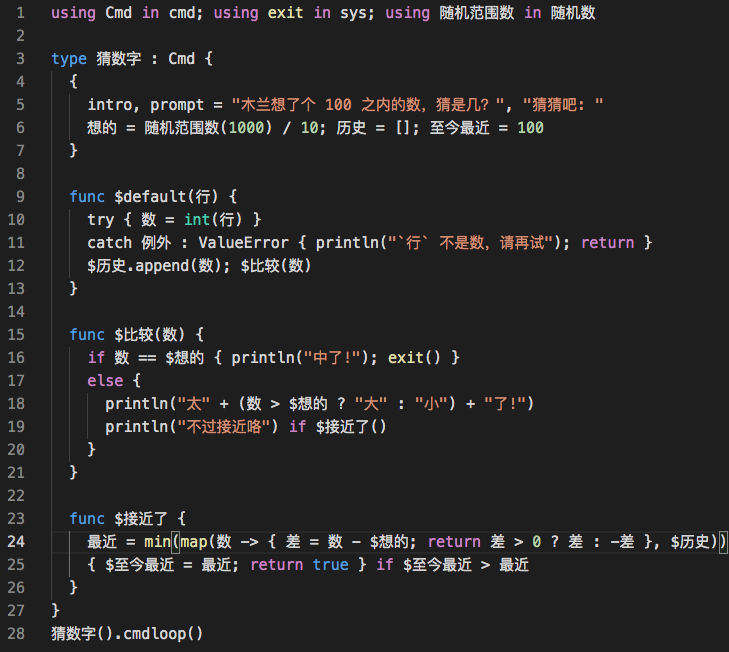
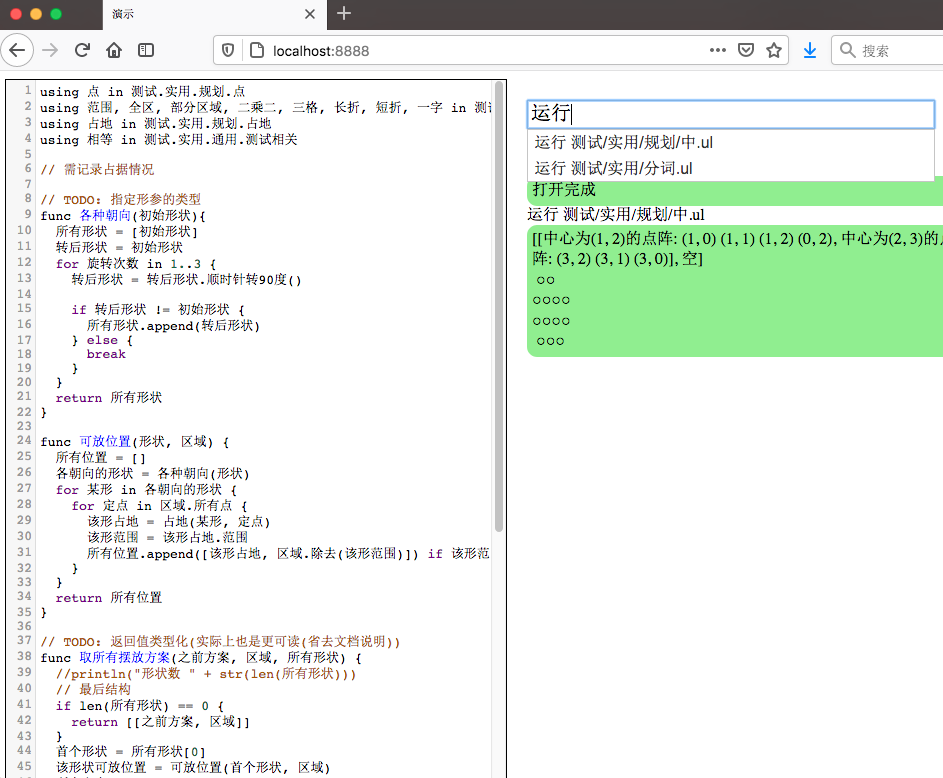
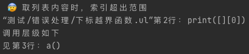
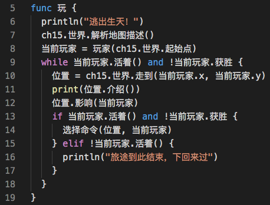

测试覆盖的、重现了的部分木兰语法[演示](https://gitee.com/MulanRevive/mulan-rework/tree/f8775de232b6a943d04b6aac8b95081c204ad4b7/%E6%B5%8B%E8%AF%95/%E6%89%8B%E5%B7%A5%E6%B5%8B%E8%AF%95/%E5%91%BD%E4%BB%A4%E8%A1%8C.ul)。用 [VS Code 插件高亮](https://marketplace.visualstudio.com/items?itemName=CodeInChinese.ulang)，调用了[草蟒库](https://pypi.org/project/grasspy-modules/)：

为木兰语言编写的在线开发环境原型的后端也用木兰编写，使用 Python 框架 tornado：

部分报错信息中文化：

用木兰改写了 Python 入门书籍的[文字冒险游戏例程](https://zhuanlan.zhihu.com/p/345139002)：

借助 Pygame 编写的小游戏：

以上代码可用 `pip install ulang` 安装木兰后运行。项目开源在 Gitee：

https://gitee.com/MulanRevive/mulan-rework

[一年前的万元悬赏](https://zhuanlan.zhihu.com/p/104001337)仍在。

2021-01-20

--------------

2021-02-17 回应评论：

- “中文编程为什么还要有if while这种东西出现，换成“如果”“假如”不好吗”

  答：重申一下，木兰编程语言语法并未使用中文关键词。想把关键词中文化大可自行 fork 修改。本项目首要目的是重现木兰语言的原始设计和功能，而此目标还 [远未达成](https://gitee.com/MulanRevive/mulan-rework/issues/I1SEU5)。

- “输入法切来切去烦不烦啊”

  答：实际上木兰原始可执行文件 [ulang-0.2.2.exe](https://github.com/MulanRevive/bounty/tree/master/%E5%8E%9F%E5%A7%8B%E8%B5%84%E6%96%99/%E5%8F%AF%E6%89%A7%E8%A1%8C%E6%96%87%E4%BB%B6) 并不支持中文命名标识符。虽然重现项目主旨在于尽量复现木兰，但这支持中文命名这一特性对于本项目的可持续性至关重要，详见《[业余项目用中文命名的舒适](https://zhuanlan.zhihu.com/p/261451253)》，因而作此变通。另一与原始可执行文件不同的功能是对报错信息的 [中文化与使用性改进](https://zhuanlan.zhihu.com/p/267686876)，这个功能也对维护、编写例程相当有益，可减轻我的开发、排错负担。

- “mulan 是Python套壳了吗?”

  答：如果对木兰的了解仅限于“套壳”、“换皮”等标签，建议先看看 [这个回答](https://www.zhihu.com/question/373711077/answer/1052597644) 了解一下编程语言的实现机制。在阅读本文之后再看看已经开源在 Gitee 了的 [木兰语言重现项目](https://gitee.com/MulanRevive/mulan-rework)，眼见为实吧。
