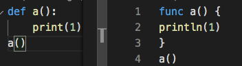

刚开始实现从 Python 源码转为木兰源码，现在支持无参数函数定义以及函数调用等，刚在 pypi 发布了 ulang 0.0.17 版本包含此功能。

下面左侧为 Python 代码，运行 `$ 木兰 -兰 XX.py` 后生成右侧的对应木兰代码：



实现机制是扩展 Python ast 库的 NodeVisitor，对每个相关语法节点编写相关生成规则。以函数定义部分为例，可见 `主体` 将函数体内声明分行显示并以大括号包围：

```python
    def visit_FunctionDef(self, 节点):
        self.另起一行(额外=1)
        self.另起一行(节点)
        self.编写('func ')
        self.编写('%s(' % 节点.name)
        self.编写(')')
        self.主体(节点.body)

    def 主体(self, 所有声明):
        self.编写(' {')
        for 声明 in 所有声明:
            self.visit(声明)

        self.另起一行()
        self.编写('}')
```

函数定义部分（visit_FunctionDef）现在看起来很简单，是因为仅仅复现了无参数函数定义，之后还需添加带参数、应变属性（attr）等等的支持，此部分将会逐渐复杂。主体部分也还需添加相应缩进。

通过复现这部分由语法树生成木兰源码的功能，从另一方面检验了之前重现的木兰语法。以标识符名称为例：

```python
    def visit_Name(self, 节点):
        if 节点.id == 'print':
            self.编写('println')
        elif 节点.id == 'chr':
            self.编写('char')
        else:
            self.编写(节点.id)
```

可见内置函数除了 Python 的 print 和 chr 之外，都沿用了 Python 的名称，这与至今重现的内置函数部分一致。

与之前复现木兰语法时类似，针对每条语法生成规则编写了对应测试。在功能覆盖上，与之前积累的测试用例有相当交集，今后考虑将木兰测试用例在两部分复用。比如，从 Python 源码开始：
```python
def echo(number):
    print(number)
echo(2)
```
转换后检查是否生成了如下目标木兰源码：
```java
func echo(number) {
    println(number)
}
echo(2)
```

另一面，解析执行上述木兰源码检查结果是否为 2。

简而言之，对木兰语言的认识对这部分功能的复现有很大帮助，过程比想象中的顺利。当然之后应该会碰到尚未复现的语法功能，且行且看吧。
