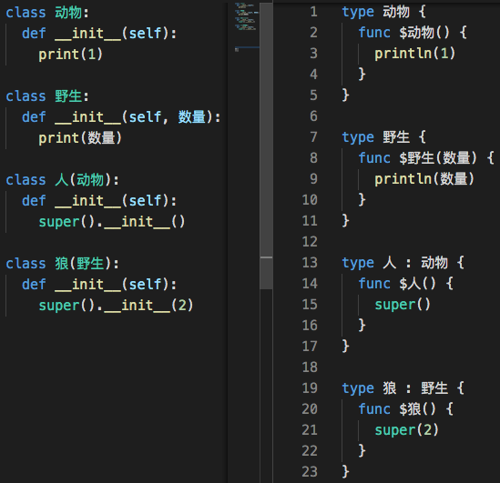

接续 [前文](https://zhuanlan.zhihu.com/p/369268306)，试着调整了几次优先级排序，除了 `super` 需在 `(` 之下以外，没看出其他门道，于是暂时将两者分别放在优先级排序最高与最低，现在所有测试用例能通过，以观后效吧。个人感觉由于优先级与语法规则的勾连，想要生成一个针对某一优先级设置的测试用例颇为烧脑，先搁置吧。

接着，既然做到了 super 语法，就在语法树生成木兰源码部分功能中复现了 super。先上 Python 与转换生成的木兰源码对比：

可见，在调用父类的构造方法时，相较 Python 需要 __init__()，木兰中可以略去，参数直接传给 super，与 Java 等其他常用语言类似。

复现了这一转换功能后，发现还需复现对此语法的支持，是通过 NameFixPass 这一语法树修改步骤的 visit_Call 实现。

完成后，前文的 `super(演示, self).__init__()`，现在只需 `super()`。0.0.17.3 发布在 PyPI（pip install ulang 安装）

回头看对比图，个人猜度，木兰的这个设计与 self 可用 $ 代替、__init__ 可用类名代替等一道，都是为了方便开发者进行类型相关操作并让代码更可读。

-----------

### ***附：代码量统计***

主要部分的代码行数统计，格式为：上次->现在。

- 木兰代码量 3050 -> 3096
  - 运行环境，实现与测试大部为木兰代码：582
  - 木兰测试用例，包括部分实用小程序（如井字棋）：2468 -> 2514
- Python 代码量（木兰实现、测试框架、语法树生成木兰中的 Python 测试代码）：3381 -> 3436
  - `分析器/语法分析器.py`：1049 -> 1055
  - `生成/木兰.py`：206 -> 213
  - `分析器/语法树处理.py`：91 -> 114
  - 未变
    - `分析器/语法树.py`：225
    - `分析器/词法分析器.py`：216
    - `功用/反馈信息.py`：175
    - `环境.py`，定义全局方法： 175
    - `交互.py`，交互环境（REPL）：148
    - `测试/期望值表.py`：144
    - `测试/unittest/报错.py`：124
    - `中.py`，主程序：95
    - `分析器/语法成分.py`，从语法分析器中提取出来的枚举常量：85
    - `测试/运行所有.py`，检验所有木兰测试代码片段：71
    - `测试/unittest/生成.py`，语法树生成木兰源码相关测试：60
    - `测试/unittest/语法树.py`，确保生成的语法树与原始版本一致，拆分报错部分：58
    - `功用/调试辅助.py`，：57
    - `setup.py`, 34
    - `测试/unittest/交互.py`，交互环境相关测试：28
    - `分析器/错误.py`：28
    - `测试/unittest/所有用例.py`：24
