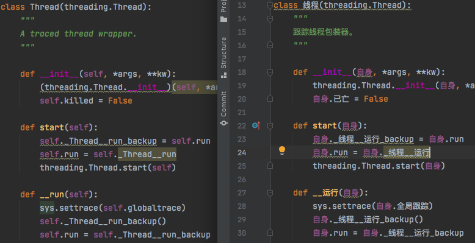

在 [Gitee Reward](https://gitee.com/gitee_reward) 发布的下列悬赏任务已经顺利完成：

- ￥100 [【新人优先】重现一个内置函数——bytes](https://gitee.com/MulanRevive/mulan-rework/issues/I3QHKV)
- ￥128 [【进阶】补完余下三十多个内置函数](https://gitee.com/MulanRevive/mulan-rework/issues/I3QHXU)

合作过程交流顺畅、效率颇高、成果符合预期。

因为之前个人一直主要在 mac 下开发，而合作者在 win10 下开发，在新人任务过程中就暴露了不少之前忽视了的跨平台问题，如 [win 下部分测试不过](https://gitee.com/MulanRevive/mulan-rework/issues/I3RNBQ?from=project-issue)。

另一个暴露的困惑已久的问题——[Windows 下两种测试方式输出相差 \r](https://gitee.com/MulanRevive/mulan-rework/issues/I3RH19?from=project-issue)，很惊喜地，合作者很快指出了问题所在。

在第二个悬赏任务中，在标识符命名中文化时，头一次发现内部函数 `_线程__运行` 的命名与类名相关，原因还待研究。

另发觉 [locals() 功能设计意图仍待揣摩](https://gitee.com/MulanRevive/mulan-rework/issues/I3RPWK?from=project-issue)。

总之，悬赏任务的收获多多，很期待后续。

此外，如 [上文](https://zhuanlan.zhihu.com/p/372021884) 打算的，已发布了 [rply 木兰定制版](https://pypi.org/project/rply-ulang/)，以规避 | 问题；还添加了 shift/reduce 歧义的调试信息，详见 [前文](https://zhuanlan.zhihu.com/p/369268306)。

-----------

### ***附：代码量统计***

主要部分的代码行数统计，格式为：上次->现在。

- 木兰代码量 3096 -> 3157
  - 运行环境，实现与测试大部为木兰代码：582
  - 木兰测试用例，包括部分实用小程序（如井字棋）：2514 -> 2575
- Python 代码量（木兰实现、测试框架、语法树生成木兰中的 Python 测试代码）：3436 -> 3612
  - `环境.py`，定义全局方法： 175 -> 275
  - `生成/木兰.py`：213 -> 239
  - `测试/期望值表.py`：144 -> 173
  - `交互.py`，交互环境（REPL）：148 -> 150
  - `测试/运行所有.py`，检验所有木兰测试代码片段：71 -> 75
  - 未变
    - `分析器/语法分析器.py`：1055
    - `分析器/语法树.py`：225
    - `分析器/词法分析器.py`：216
    - `功用/反馈信息.py`：175
    - `测试/unittest/报错.py`：124
    - `分析器/语法树处理.py`：114
    - `中.py`，主程序：95
    - `分析器/语法成分.py`，从语法分析器中提取出来的枚举常量：85
    - `测试/unittest/生成.py`，语法树生成木兰源码相关测试：60
    - `测试/unittest/语法树.py`，确保生成的语法树与原始版本一致，拆分报错部分：58
    - `功用/调试辅助.py`，：57
    - `setup.py`, 34
    - `测试/unittest/交互.py`，交互环境相关测试：28
    - `分析器/错误.py`：28
    - `测试/unittest/所有用例.py`：24

