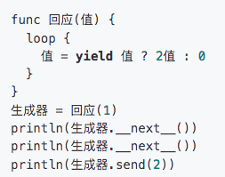

这两周过的飞快，先上木兰代码截图，省得像上次似的一堆误会。



这是完成了的第二批悬赏任务之一的成果：

- ￥188 [【进阶】重现所有 yield 相关语法](https://gitee.com/MulanRevive/mulan-rework/issues/I3SNP3?from=project-issue)
- ￥128 [重现语法——赋值时指定变量类型](https://gitee.com/MulanRevive/mulan-rework/issues/I3RQ0C?from=project-issue)
- ￥100 [补完二元表达式（bin_expr）的四个运算符](https://gitee.com/MulanRevive/mulan-rework/issues/I3RQ0A?from=project-issue)

下面主要记下合作期间的一些发现。

在 [实现二元运算符时](https://gitee.com/MulanRevive/mulan-rework/pulls/19) ，发现与 Python 中的优先级有不同，需更全面评估。如位左移 << ，木兰中的优先级低于 < 而 python 相反。1<2<<3 在木兰中为 8 而 Python 为 True。

另外发现，之前在实现语法树生成木兰源码时 [误以为木兰不支持链式运算](https://zhuanlan.zhihu.com/p/372021884) ，但现在发现是支持的：
```
> 1<2<3
true
> 1<2<0
false
```

此任务中，合作者还对代码作了格式化。

重现 [yield 语法时](https://gitee.com/MulanRevive/mulan-rework/pulls/21) ，在推敲标识符命名中发现至今重现的木兰语法规则的一个规律：表达式可以是声明的一部分，而声明不会是表达式的一部分。不知这规律是否常见。

另外，向合作者学习了 [yield 更多功能](https://gitee.com/MulanRevive/mulan-rework/issues/I3TC3H?from=project-issue) 。

重现 [赋值时指定变量类型时](https://gitee.com/MulanRevive/mulan-rework/pulls/23) ，更有意外发现。`a:str` 可以在交互环境下运行，但不能在源码中运行，后发现是交互环境中为了支持不用 print 就输出表达式的值而导致的副效应。

之后，在因上面而加的语法规则的设计意图尚不明确的情况下，我出了个馊用例：
```
a=10
b=(a:int)
print(b)
```
随后发现 `(a:int)` 这一语法与 lambda 表达式有关（在早先任务列表中被列在 [功能不确定](https://gitee.com/MulanRevive/mulan-rework/issues/I1SEU5?from=project-issue) 部分 ），于是商议决定将此部分内容回退后另开任务解决，以免此任务滚雪球式扩大。

随着合作者对项目越来越熟悉，非常期待今后的技术交流和探讨。

在项目维护方面，修复了跨平台路径导致的 [windows 下测试问题](https://gitee.com/MulanRevive/mulan-rework/issues/I3RNBQ?from=project-issue) ，同时修复了 [Docstring 生成木兰源码](https://gitee.com/MulanRevive/mulan-rework/commit/e26477ba527c300f5f5fe339263ed323d27e5606) 的用例。
并在解决 [流水线测试问题](https://gitee.com/MulanRevive/mulan-rework/issues/I3SBUA?from=project-issue) 时发现了一个 rply 木兰定制版在 PyPI 发布缺失 whl 文件（库安装时会在 linux 下构建不过）的问题。


-----------

### ***附：代码量统计***

主要部分的代码行数统计，格式为：上次->现在。

- 木兰代码量 3157 -> 3201
    - 运行环境，实现与测试大部为木兰代码：582
    - 木兰测试用例，包括部分实用小程序（如井字棋）：2575 -> 2619
- Python 代码量（木兰实现、测试框架、语法树生成木兰中的 Python 测试代码）：3612 -> 3794
    - `分析器/语法分析器.py` 此次格式化代码有额外添加行数：1055 -> 1144
    - `分析器/语法树.py`：225 -> 267
    - `生成/木兰.py`：239 -> 242
    - `分析器/词法分析器.py`：216 -> 231
    - `测试/期望值表.py`：173 -> 177
    - `交互.py`，交互环境（REPL）：150 -> 149
    - `测试/unittest/报错.py`：124 -> 126
    - `分析器/语法树处理.py`：114 -> 119
    - `分析器/语法成分.py`，从语法分析器中提取出来的枚举常量：85 -> 88
    - 未变
        - `环境.py`，定义全局方法： 275
        - `功用/反馈信息.py`：175
        - `中.py`，主程序：95
        - `测试/运行所有.py`，检验所有木兰测试代码片段：75
        - `测试/unittest/生成.py`，语法树生成木兰源码相关测试：60
        - `测试/unittest/语法树.py`，确保生成的语法树与原始版本一致，拆分报错部分：58
        - `功用/调试辅助.py`，：57
        - `setup.py`, 34
        - `测试/unittest/交互.py`，交互环境相关测试：28
        - `分析器/错误.py`：28
        - `测试/unittest/所有用例.py`：24
