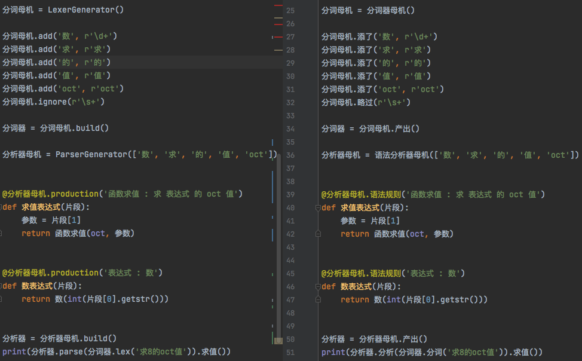

今后也许会更身不由己，这段时间尽可能将 [木兰重现项目](https://gitee.com/MulanRevive/mulan-rework) 和其依赖的 rply 库中的一些纰漏解决、夯实基础。

## 木兰

- 支持 # 语法，等价于 len()，如 `#[3,33]` 输出 2。[见此提交](https://gitee.com/MulanRevive/mulan-rework/commit/a5f12497465352fb2c0db7cd7de45282a1b208af)
- 输出数据结构时内部字符串略去引号：[集合、多项](https://gitee.com/MulanRevive/mulan-rework/commit/1f20783a49cb66afa68bef628a6640aa16fcdfdf)；[字典](https://gitee.com/MulanRevive/mulan-rework/commit/8ed7d5e58a77eada9efdea0740f1c5f9ecabc357)。比如 `d={1:'a'}`，python 中 print 输出 `{1: 'a'}`，而木兰输出 `{1: a}`
- [报错中模块名为空问题](https://gitee.com/MulanRevive/mulan-rework/issues/I37WKB?from=project-issue) 比较独特，逆向中看不出头绪，硬 [加了个补丁](https://gitee.com/MulanRevive/mulan-rework/commit/70a86e16d6f0b2aa13d724d868d844918b3e352e) 实现了与原始可执行文件行为一致
- 之前发现几处 re.DOTALL 不解何意，现 [基本确定并无效果](https://gitee.com/MulanRevive/mulan-rework/commit/cd68beec2e51e6528e8c9990dfee6e60f2a997b3)
- 【已实现，未发布】改进报错信息: 形参默认值不全。如下面函数：`func f(x=2, y) { return x }`，python 并不定位具体参数：`non-default argument follows default argument`，现在木兰可定位：
```
 😰 语法错误：文件 "【标准输入】", 第1行, 第13列, 参数“y”之前的“x”有默认值，它也需要一个表达式指定默认值
func f(x=2, ✋y) { return x }
```
- 【待复现】发现木兰支持如此定义多项（tuple）：`a = 3; b = 4; c = (a,b)`，但并不支持 `c=(3,4)`。因有依赖打算在 [此悬赏任务](https://gitee.com/MulanRevive/mulan-rework/issues/I3TIKJ?from=project-issue) 之后完成。

当前有共三个悬赏任务，欢迎参与。

## 依赖库：rply 木兰定制版

自 [前文](https://zhuanlan.zhihu.com/p/372021884) 开始，将 rply 作了分支后剪裁、定制了 [rply-ulang 库发布在 PyPI](https://pypi.org/project/rply-ulang/)。

### 1. API 中文化

将木兰中使用到的 rply 的 API 进行了中文化，演示效果如下：


本来直接把英文 API 改为了中文，后发现为了同时支持 [逆向工程](https://github.com/MulanRevive/mulan) 正常运行，仍需保留原英文 API。

### 2. 清理木兰重复代码

之前发现木兰对 rply 的 parser [作了些许修改](https://gitee.com/MulanRevive/mulan-rework/commit/f6dadf103508880e42ed054152aadee131e20ee7) 以支持某些语法， 现决定 [并入 rply 定制版](https://github.com/nobodxbodon/rply/commit/dd0ef0319556d0d6d76b44d562669e708784bd32)，以减少综合代码维护量。

### 3. 修复报错的列号不准问题

半年多前提了 rply 一个 [报错列号不准问题](https://github.com/alex/rply/pull/95#issuecomment-729513800)，一直没看到回应，研究相关代码部分时顺便作了中文化，加了个 [补丁](https://github.com/nobodxbodon/rply/commit/4afbd7f12f200790d0466c23f1e0660b770e5ef6)

其他定制内容见 [项目源码库](https://github.com/nobodxbodon/rply)。


-----------

### ***附：代码量统计***

主要部分的代码行数统计，格式为：上次->现在。

- 木兰代码量 3201 -> 3206
    - 运行环境，实现与测试大部为木兰代码：582
    - 木兰测试用例，包括部分实用小程序（如井字棋）：2619 -> 2624
- Python 代码量（木兰实现、测试框架、语法树生成木兰中的 Python 测试代码）：3794 -> 3711
    - `分析器/语法分析器.py` 此次格式化代码有额外添加行数：1144 -> 1159
    - `环境.py`，定义全局方法： 275 -> 284
    - `分析器/词法分析器.py`：231 -> 236
    - `测试/期望值表.py`：177 -> 180
    - `交互.py`，交互环境（REPL）：150 -> 149
    - `测试/unittest/报错.py`：126 -> 127
    - 未变
        - `分析器/语法树.py`：267
        - `生成/木兰.py`：242
        - `功用/反馈信息.py`：175
        - `分析器/语法树处理.py`：119
        - `中.py`，主程序：95
        - `分析器/语法成分.py`，从语法分析器中提取出来的枚举常量：88
        - `测试/运行所有.py`，检验所有木兰测试代码片段：75
        - `测试/unittest/生成.py`，语法树生成木兰源码相关测试：60
        - `测试/unittest/语法树.py`，确保生成的语法树与原始版本一致，拆分报错部分：58
        - `功用/调试辅助.py`，：57
        - `setup.py`, 34
        - `测试/unittest/交互.py`，交互环境相关测试：28
        - `分析器/错误.py`：28
        - `测试/unittest/所有用例.py`：24
