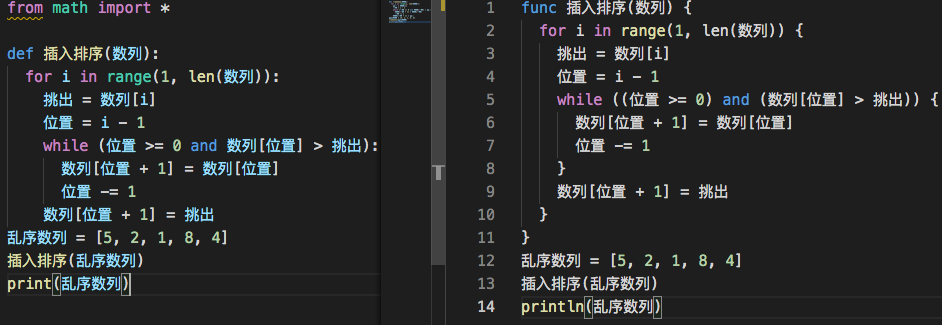
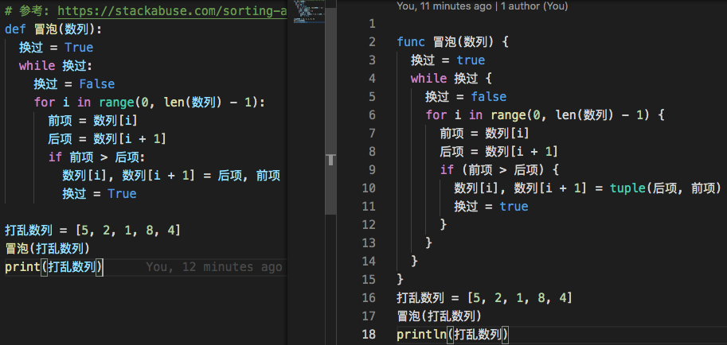
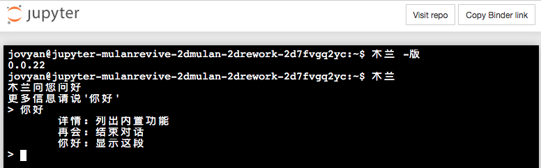
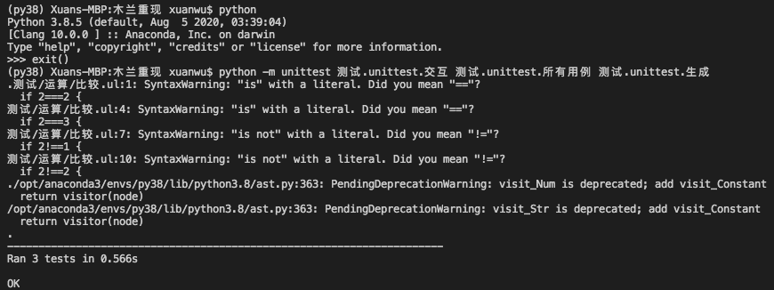

之前复现了一部分由 Python 自动转换为木兰代码的功能，运行如下命令就能输出木兰代码：`$ 木兰 -兰 某某.py`，但尚缺失一些基本语法支持，该功能尚未达到实用程度。

这两天将插入和冒泡排序算法为目标，按需复原了相关部分，达成效果如下（左 Python 右木兰）：

下面打算以 [猜数字例程](https://gitee.com/MulanRevive/mulan-rework/blob/master/%E6%B5%8B%E8%AF%95/%E6%89%8B%E5%B7%A5%E6%B5%8B%E8%AF%95/%E5%91%BD%E4%BB%A4%E8%A1%8C.ul) 为目标继续补完转换功能。

另外，前几天有位在项目首页加了 [binder 在线环境](https://mybinder.org/v2/git/https%3A%2F%2Fgitee.com%2FMulanRevive%2Fmulan-rework/HEAD)，这才知道有这样的免费服务：

还干了件闲事。木兰重现项目伊始时，就确认了按原始实现基于 python3.7，毕竟离 2023 年还有段时间。不过，现在积攒了这么些测试用例，忍不住想看看如果以后需要升级到 Python 3.8 的话有多大工作量。结果是 [添了一处代码](https://gitee.com/MulanRevive/mulan-rework/commit/5758d173b1b45e94f7c7ac43dc6bf4d76c34456c)，就通过了语法功能部分的测试用例，不过有下面几个语法树相关报警待研究：

每年应付一次 Python 大版本升级导致的语法树变动，似乎还可以接受。先搁着，需要的话再说吧。

-----------

### ***附：代码量统计***

主要部分的代码行数统计，格式为：上次->现在。

- 木兰代码量 3206 -> 3259
    - 运行环境，实现与测试大部为木兰代码：582
    - 木兰测试用例，包括部分实用小程序（如井字棋）：2624 -> 2677
- Python 代码量（木兰实现、测试框架、语法树生成木兰中的 Python 测试代码）：3711 -> 3867
    - `生成/木兰.py`：242 -> 350
    - 其他似乎没怎么变
    
嗯，每次都要手动统计忒二了，用木兰写个自动统计的脚本吧~