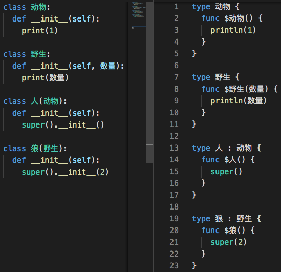

此文为 [两周后live讲座](https://www.zhihu.com/lives/1596877608825921536) 的第二部分。因为希望在讲座中有更多时间探讨木兰功能设计和实现细节之外的内容，先发布此部分，以便在讲座中视情况简述或掠过。欢迎批评。

个人与木兰的渊源请见 [《重温初见木兰编程语言的那个战场》](https://zhuanlan.zhihu.com/p/265091649)。下面是个人在 [木兰重现项目](https://gitee.com/MulanRevive/mulan-rework) 中的一些发现，大多数在之前的 [专栏文章](https://www.zhihu.com/column/ulang) 中已提到，在此作一集锦。

## 功能设计

### 从命令行选项看周边功能

这是原始木兰的选项：


下面是在前不久的悬赏任务中完成的选项复现，中文化后也许更易理解。尚待调研的是 [dump-blockly 功能](https://gitee.com/MulanRevive/mulan-rework/issues/I5V2ZH?from=project-issue)：


可见，原始木兰并未刻意掩饰它与 Python 的关联，并且通过互转、pdb调试、反汇编等利用了 Python 的生态。其中语法树等功能更像是木兰研发组使用的，还有个隐藏选项 dump-tokens （显示分词）用于调试词法分析结果。


### 语言设计

语法设计上的一些取舍，可以看到在有限的常用特殊符号的限制中，有时牵一发而动全身。下面是一些与 Python3 不同的设计，按重现先后排序。更多的记录在 [此文档](https://gitee.com/MulanRevive/mulan-rework/blob/master/%E6%96%87%E6%A1%A3/%E7%94%A8%E6%88%B7%E6%89%8B%E5%86%8C/%E6%AF%94%E8%BE%83Python/%E8%AF%AD%E6%B3%95%E5%AF%B9%E6%AF%94.md)。

- 由于 // 用于标注单行注释，/ 在 [整数相除时得整数，小数时得小数](https://zhuanlan.zhihu.com/p/134029658)：

```
> 4/3
1
> 4.0/3
1.3333333333333333
```

对比 python3：

```
>>> 4/3
1.3333333333333333
>>> 4//3
1
```

- [a=2; a+1 会报错](https://zhuanlan.zhihu.com/p/142290539)

```
> a=2; a+1
 😰 语法错误：文件 "【标准输入】", 第1行, 第7列, 没认出这个词 "+"
a=2; a✋+1
```

对比 python：
```
>>> a=2; a+1
3
```


- [{} 代替强制缩进](https://zhuanlan.zhihu.com/p/140430769)，视觉效果请见讲座简介图即项目首页图，以及下文的截图。后来发现 [在命令行下粘贴代码的一点优势](https://zhuanlan.zhihu.com/p/237379701)。

- [范围语法“下限..上限 by 间隔”](https://zhuanlan.zhihu.com/p/157251383)：

```
for 数 in 4..-1 by -2 {
  println(数)
}
for 数 in 0..<4 by 2 {
  println(数)
}
```

- [当函数没有形参时，定义和调用时都可以省去括号](https://zhuanlan.zhihu.com/p/158432288)，这里想到“编程语言设计参考自然语言语法和用词，不仅能增进代码可读性，各语法元素可能更融洽和有持久生命力，因为自然语言本身经过了千百年的演化和考验。”：

```
func 问好 {
  print('吃了么')
}
问好 
```

- 支持 [多行匿名](https://zhuanlan.zhihu.com/p/161263901)：


- [支持乘法省略乘号“2长+3宽”等等](https://zhuanlan.zhihu.com/p/205190684)，及它带来的一些副效应:
[从木兰的 1[0] = [0] 有感编程语言语法设计的舍与得](https://zhuanlan.zhihu.com/p/352660693)


- $ 可取代 self，顺便省去括号。左右两边都是可运行的木兰代码：


刚发现，本地（？）变量和函数都用$前缀，形式上更一致

一点 [体会](https://zhuanlan.zhihu.com/p/261048633)：
> 作为未参与木兰原始设计的第三方，仅从复现出的功能很难完全领会设计意图。就个人感觉，木兰的 $ 相关语法设计简化了 Python 的 self 相关语法。对 self 的语义拓展虽然看似信手拈来但也有合理之处。是否对多线程有特别好处待研究。

- [字符串插值](https://zhuanlan.zhihu.com/p/262835743)：


- 可省去 `__init__`:




说牵一发动全身也许夸张，这是将常用特殊符号左右腾挪完成不同语义的几个例子：

- 木兰用大括号 {} 标记块的头尾，取代了 Python 中的冒号。冒号就可以用于其他语义。如用冒号指定 [变量](https://zhuanlan.zhihu.com/p/376747637)、[形参](https://zhuanlan.zhihu.com/p/592786914)、超类的类型等。以及 `数 > 想的 ? "大" : "小"` 这种三元表达式。而作为副效应，空字典不能用 {}，于是用 {:} 表达。连带地，lambda 表达式不用冒号而 [改用了 -> 且函数体支持多语句](https://zhuanlan.zhihu.com/p/161263901)；字符串插值不用大括号而用反引号。
- 前面提到，// 用于注释，就不能用于除法。# 省下来转用于简化 len，也许是 len 较常用的缘故？

```
> #[1,2,3,2,1]
5
```


## 实现

比较明显的一点，是用 rply 这一框架而非手写分析器。

个人体会最深的是，在语法复现的过程中，多数语法规则可以用较少的代码逐条增量实现。比如 [try-catch-finally](https://gitee.com/MulanRevive/mulan-rework/pulls/45) 的七条规则可以分为六步实现，每步提交基本十到二十行 Python 代码还包括测试。在合作时审阅代码比较方便。

使用该框架可能的性能潜力仍待探究。之前一点粗浅摸索：
- [为何木兰采用 RPly 而非 Ply？RPython 和 PyPy 才是真意？](https://zhuanlan.zhihu.com/p/131780649)
- [神奇的 RPython 初探：解释器性能四百倍提升](https://zhuanlan.zhihu.com/p/132503029)

## 需求

作为软件项目，原本应从需求出发，放在最后看似本末倒置。但木兰重现项目最缺的、也是不少语言工具原创项目缺少的也是这部分。

很可惜，木兰原始团队没有机会详述他们当初的需求分析。和语言设计意图一样，重现项目也只能根据功能反过来进行揣测。

从 [当年的新闻中](https://gitee.com/MulanRevive/bounty/blob/master/%E5%8E%9F%E5%A7%8B%E8%B5%84%E6%96%99/%E8%AE%BE%E8%AE%A1%E6%96%87%E6%A1%A3/%E5%8F%91%E5%B8%832.png)，可以看到木兰当初已在编程教育入手推广。在重现项目中发现的一些实用相关的问题，如 [不支持“if 键 in 字典”](https://zhuanlan.zhihu.com/p/372021884)、[重复引用行为不一致](https://zhuanlan.zhihu.com/p/350337192) 等，似乎印证了它当时并未达到业界使用的程度，但足够编程入门教学使用。

相对于醒目的功能，非功能性需求是更易被忽视的。尤其是前端设计中关于人机交互、易用性的部分。很不幸地，木兰团队当年关于这部分的讨论也未能留下什么资料。

虽木兰难有基于原始需求继续演进的机会，但对于有志于自研语言工具的各位来说，面向哪个领域、哪些应用场景、哪些使用人群、依托什么现有生态，是值得在着手实现之前考量、在实践过程中调整的问题。

最后借 Ruby 作者 [松本行弘的话](https://juejin.cn/post/6844903909530533902)：“自己想用就足够了”。