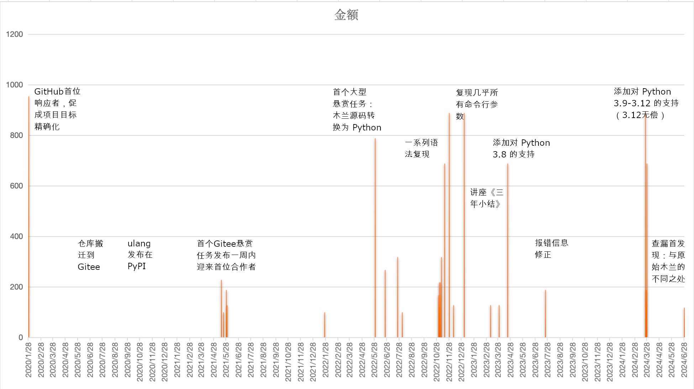

## 木兰编程语言重现项目

### 简介

作者：吴烜等

开源协议：GPL-3.0

项目地址：https://gitee.com/MulanRevive/mulan-rework

旨在重现 2020 年初报道后即被指为「Python 套壳」、「换皮」的木兰编程语言工具的所有功能。揣摩设计思路、验证实现技术路径及其可持续维护性。为低代价实现原创编程语言尤其是前端部分提供标本，也通过悬赏任务为开源合作探索新模式。

### 历程

五年前 [因缘巧合的邂逅](https://zhuanlan.zhihu.com/p/265091649) 后，一月二十三日启动木兰重现项目并重金悬赏。

一月二十五日即于 GitHub 迎来首位响应者。感激 @thautwarm，受教良多。期间项目目标精确化。

2020 年六月项目搬迁到开源中国的 Gitee 平台。

至 2023 年一月复现几乎所有命令行选项，作了讲座 [三年小结](https://www.zhihu.com/lives/1596877608825921536)。

继 2023 年四月添加对 Python 3.8 的支持后，2024 年陆续添加了对 Python 3.9-3.12 的支持。

下图是悬赏历史，详见[收支账本](https://gitee.com/MulanRevive/bounty/tree/master/%E6%94%B6%E6%94%AF%E8%B4%A6%E6%9C%AC)：

合作体会：

- 平台支持之重要：Gitee 悬赏功能于 2021 年四月底上线，合作从此加速
- 任务细化，确保可控
- 团队之珍贵

项目相关文章汇于 [知乎专栏](https://www.zhihu.com/column/ulang)。

### 希冀

原创编程语言的最大困难之一，是要「从零手写编译器」的心理阴影。希望此项目能让更多业务开发者可以更专注于语言工具与人的交互设计，并在需要时借助现有生态、以尽可能小的代价完成原型验证并逐渐过渡到实用产品。

### 鸣谢

期间碰到开发流程和悬赏等相关问题提出报告后，Gitee 官方充分支持响应，非常感激！

感激所有项目参与者的资助、合作时的耐心和探究精神！

为重现五年前昙花一现的 [ulang-0.2.2.exe](https://gitee.com/MulanRevive/bounty/tree/master/%E5%8E%9F%E5%A7%8B%E8%B5%84%E6%96%99/%E5%8F%AF%E6%89%A7%E8%A1%8C%E6%96%87%E4%BB%B6) 的花费虽可观，但和原创团队从设计到推广所耗心血不可相提并论。致敬他们的创意、热情和付出！

天涯若比邻。